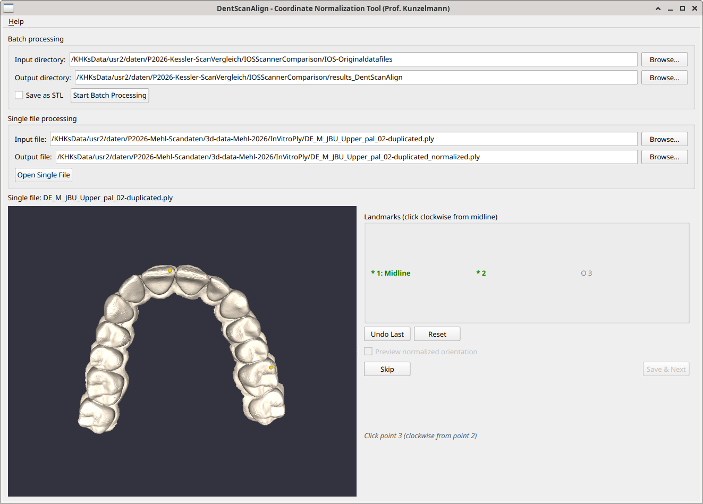

# DentScanAlign

**Coordinate Normalization Tool for Dental Intraoral Scans**

Author: Prof. Dr. Karl-Heinz Kunzelmann ([www.kunzelmann.de](https://www.kunzelmann.de))

## Overview

DentScanAlign is a standalone Qt/VTK application for interactive pre-alignment of dental intraoral STL, PLY or OBJ scans. It normalizes arbitrary scanner coordinate systems to a standardized anatomical orientation, preparing scans for batch ICP registration in DentScanComparePro. While it can process single mesh datasets, it is highly optimized for automatic throughput of a large number of datasets. 



### What It Does

- Loads STL, PLY and OBJ files from intraoral scanners
- Allows interactive placement of 3 anatomical landmarks
- Computes a transformation matrix to normalize the coordinate system
- Exports aligned files and JSON metadata
- Can convert PLY and OBJ to STL

### Target Coordinate System

After normalization, all scans share a consistent orientation:

| Axis | Direction | Anatomical Meaning |
|------|-----------|-------------------|
| X | Left (-) to Right (+) | Transversal |
| Y | Posterior (-) to Anterior (+) | Sagittal (midline direction) |
| Z | Apical (-) to Occlusal (+) | Vertical |
| Origin | Mesh centroid | Center of scan |

## Prerequisites

### System Requirements

- Linux (tested on Debian 13)
- C++17 compatible compiler (GCC 10+)
- CMake 3.16+

### Libraries

| Library | Version | Notes |
|---------|---------|-------|
| Qt | 6.x | Widgets, Concurrent modules |
| VTK | 9.3 | With Qt support enabled |
| CGAL | 6.0.1 | Surface mesh processing |
| Eigen | 3.4.0 | Matrix computations |
| Boost | 1.83+ | Required by CGAL |

### VTK Installation

DentScanAlign expects a custom VTK build at `~/VTK-install-linux/`. If your VTK is installed elsewhere, modify `VTK_DIR` in `CMakeLists.txt`.

## Build Instructions

```bash
# Clone or navigate to the project
cd ~/claude-code/DentScanAlign

# Create build directory
mkdir -p build && cd build

# Configure and build
cmake ..
make -j$(nproc)

# Run
./DentScanAlign
```

### Build Options

For optimized performance:

```bash
cmake -DCMAKE_BUILD_TYPE=Release ..
make -j$(nproc)
```

## Quick Start

1. **Launch** the application: `./build/DentScanAlign`

2. **Select directories**:
   - **Input**: Folder containing STL files from your scanner
   - **Output**: Folder where normalized files will be saved

3. **Click "Start Processing"** to load the first scan

4. **Place 3 landmarks** (click on the mesh):
   - Point 1: Anterior midline (e.g., central incisor contact point)
   - Point 2: Right side (clockwise from point 1 when viewing occlusally)
   - Point 3: Left side (clockwise from point 2)

5. **Review** the automatically computed preview

6. **Click "Save & Next"** to save and proceed to the next scan

### Keyboard Shortcuts

- After placing 3 landmarks, the "Save & Next" button receives focus
- Press Enter/Space to quickly save and continue

## Output Structure

```
output_directory/
├── alignments/           # JSON metadata files
│   ├── scan1.json
│   └── scan2.json
└── normalized/           # Transformed STL files
    ├── scan1.stl
    └── scan2.stl
```

### JSON Metadata

Each alignment JSON contains:
- Source file path
- Landmark positions
- Fitted plane parameters
- Computed axes (X, Y, Z)
- 4x4 transformation matrix
- Timestamp

## Project Structure

```
DentScanAlign/
├── CMakeLists.txt
├── README.md
├── CLAUDE.md              # AI assistant context
├── docs/
│   ├── implementation-plan.md
│   ├── developer-handoff.md
│   └── user-manual.md
└── src/
    ├── main.cpp
    ├── core/              # Mesh I/O, segmentation
    ├── alignment/         # Transform computation
    └── gui/               # Qt/VTK interface
```

## Related Projects

- **DentScanComparePro**: Batch ICP registration and metrics computation (reads output from this tool)
- **DentScanCompare**: Original comparison tool (reference implementation)

## Workflow Integration

```
┌─────────────────┐     ┌───────────────────┐     ┌─────────────┐
│  Raw STL Scans  │ --> │   DentScanAlign   │ --> │ Normalized  │
│  (arbitrary     │     │   (this tool)     │     │ STL files   │
│   orientation)  │     └───────────────────┘     └─────────────┘
                                                        │
                                                        v
                        ┌───────────────────┐     ┌─────────────┐
                        │ DentScanComparePro│ --> │ CSV metrics │
                        │   (batch ICP)     │     │ for R/SPSS  │
                        └───────────────────┘     └─────────────┘
```

## License

This project is licensed under the **GNU General Public License v2.0 or later** (GPL-2.0-or-later).

See the [LICENSE](LICENSE) file for the full license text.

```
SPDX-License-Identifier: GPL-2.0-or-later
```

## Support

For questions about the software, visit [www.kunzelmann.de](https://www.kunzelmann.de)
